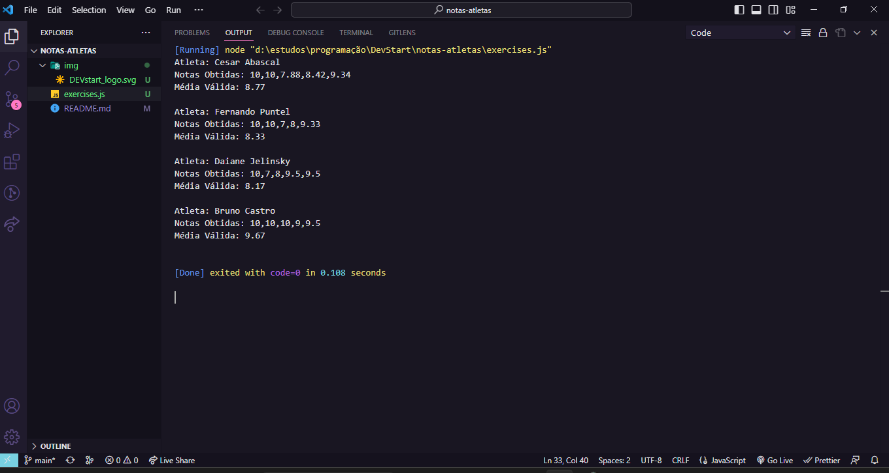

<h1 align = "center">

<p>🤖programming logic🤖</p>
</h1>

## **about📖**

this is a **DEVstart** challenge (front-end teaching program), programming logic done in javascript, **I hope you like it**.

## **project description🤓**

in this project we were asked to create an application capable of receiving the name and grades of an athlete, calculating the average and presenting it to the user.

## **technologies used👾**
- **[JavaScript](https://js.org/)**

## **download the code🤌** 
```bash
# Clone the project
$ git clone https://github.com/kelvin369/notas-atletas.git
```
## **challenge solution image🤯**
<h1></h1>